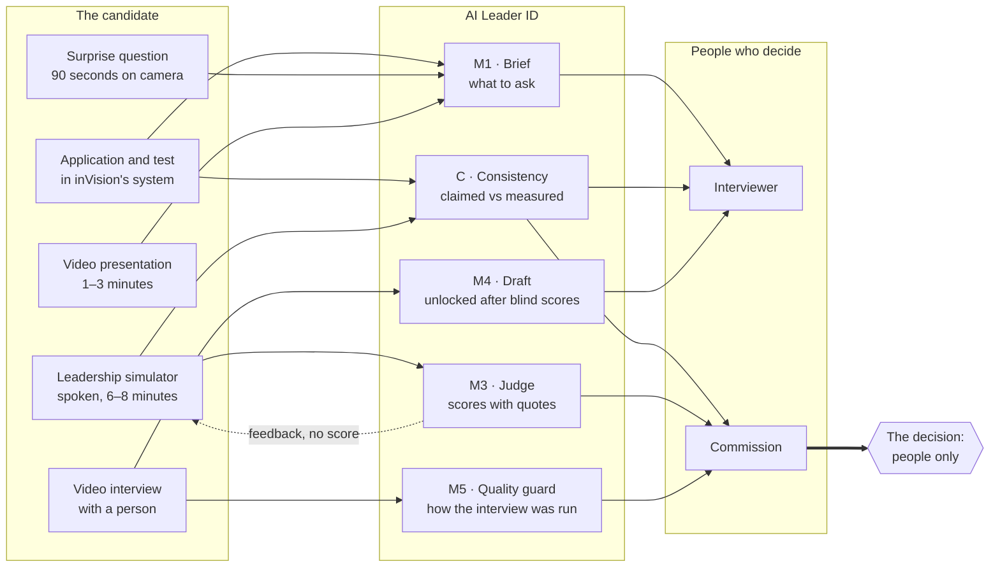
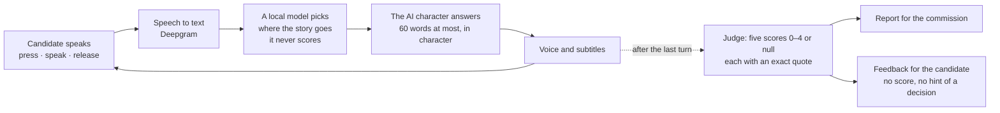
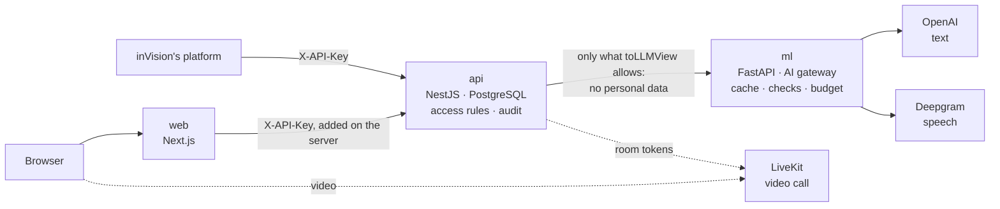
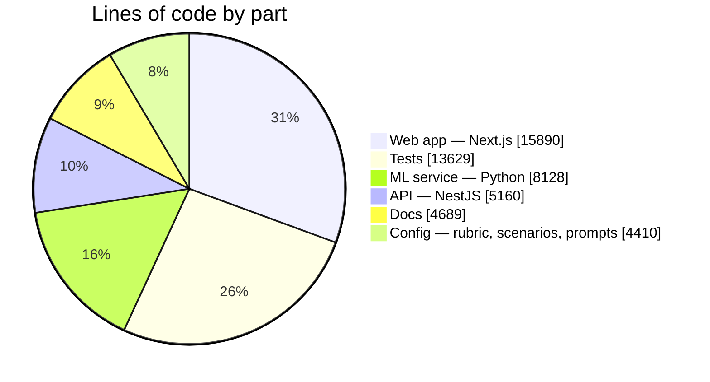
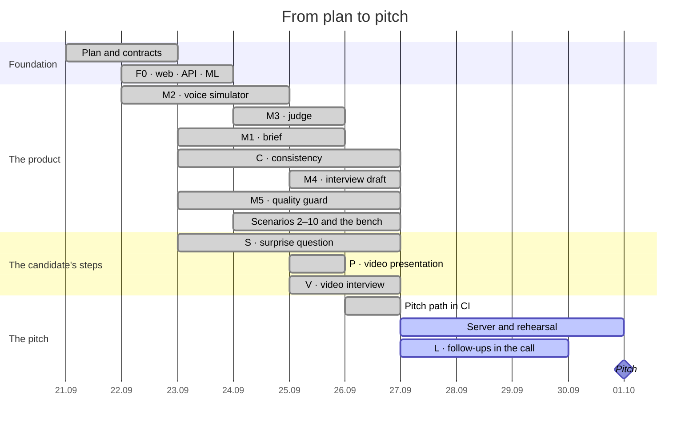
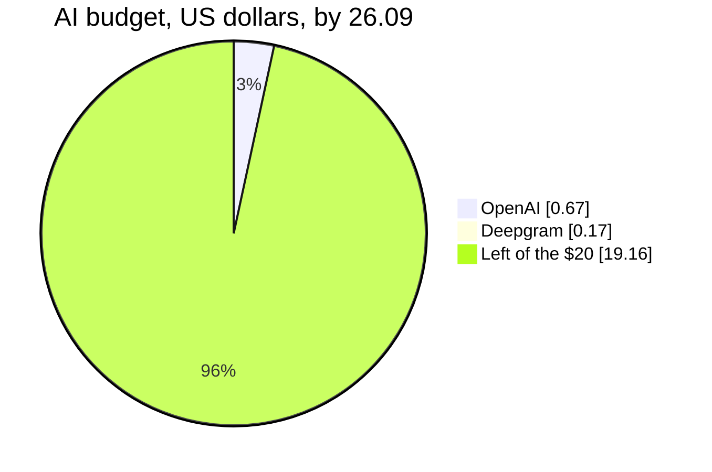

<div align="center">

<h1>AI Leader ID</h1>

<p><b>An AI layer around the admissions interview at <a href="https://invisionu.education">inVision U</a>.<br/>
It helps people see a candidate's leadership — with evidence — and never decides for them.</b></p>

[](https://github.com/mmeirbek/invisionu-new-chapter/actions/workflows/ci.yml)
[](https://github.com/mmeirbek/invisionu-new-chapter/commits/main)
[](https://github.com/mmeirbek/invisionu-new-chapter/commits/main)
[](https://github.com/mmeirbek/invisionu-new-chapter/pulls?q=is%3Apr+is%3Amerged)
[](https://github.com/mmeirbek/invisionu-new-chapter/issues?q=is%3Aissue)
[](https://github.com/mmeirbek/invisionu-new-chapter/graphs/contributors)
[](https://github.com/mmeirbek/invisionu-new-chapter)
[](https://github.com/mmeirbek/invisionu-new-chapter)


**Decentrathon 5.0 · inDrive track** — built in one week by a team of four. Pitch: 1 October 2026.

</div>

---

## In one minute

**inVision U** — a faculty of Satbayev University founded by the CEO of inDrive — chooses students for their leadership, not only their grades. Registration, the application form, the test and the commission's decisions already live in inVision's own system. The step that decides the most is the interview, and an interview is thirty minutes of *talking about* leadership.

**AI Leader ID** gives the people who choose better material, all around that interview:

- **before it**, a brief for the interviewer: what to ask, and what in the application does not add up;
- **in place of more talk**, a leadership simulator: a short spoken role-play in English where the candidate *handles* a hard situation in a team;
- **after it**, a report built on the candidate's exact words, a draft the interviewer sees only after scoring on their own, and a check of how the interview itself was run.

> [!IMPORTANT]
> **A human always makes the decision.** Nothing in this system accepts, rejects or ranks anyone. Every AI statement carries the candidate's exact words and where they come from, so a person can check it in one click.

## The problems it solves

| The problem today | What AI Leader ID does about it |
| --- | --- |
| In an interview, leadership is **claimed**, not **shown** | A spoken simulation: the candidate leads a team through a conflict with an AI character and shows what they would actually do |
| AI interview tools score people and **cannot say why** | Every score comes with a word-for-word quote and its source, and code checks each quote. No evidence means "not enough data" — never a low score |
| Answers can be **rehearsed or copied** from friends | Ten different scenarios, one chosen at random, and one surprise question written from the candidate's own application: one attempt, 90 seconds |
| The application says "English C2", and **nobody checks** | A consistency check sets what was claimed against what was measured, and suggests a question to ask |
| **Weak English hides** a strong leader | English is measured on its own and never changes a leadership score |
| The AI's opinion **anchors the interviewer** | Blind scoring: the server refuses to show the AI draft until the interviewer has saved their own scores |
| Interviewers ask **leading questions** and grade on **different scales** | A quality guard shows signals and recommendations about the interview — never a verdict about anyone |
| Personal data **leaks into AI models** | Names, IDs, contacts, photos, gender, region, school and family income never reach a model. Neither does any video: only its transcript |
| AI is **expensive**, and a live demo is **fragile** | Every model call goes through one gateway with a cache and a budget cap, and the whole demo replays recorded answers with no network |

## How it works



### Inside the simulator

The candidate speaks; they never type or paste. Each turn goes round this loop, and the whole conversation is scored only at the end.



### Who sees what

| | Candidate | Interviewer | Commission |
| --- | :---: | :---: | :---: |
| The brief | — | ✓ | ✓ |
| Simulation scores | never | never — they score blind | ✓ |
| Feedback after the simulation | ✓ without a score | ✓ | ✓ |
| The AI draft of the interview | — | only after saving their own scores | ✓ |
| Surprise answer and presentation videos | their own, before sending | ✓ | ✓ |
| Interview quality and calibration | — | — | ✓ |

The admin sees everything, and every video view is written to the audit log.

## What we measure: D.R.I.V.E.

inVision U's five leadership competencies. Each is scored `0–4`, or `null` when there is not enough evidence.

| | Competency | What counts as evidence |
| :---: | --- | --- |
| **D** | Disciplined Resilience | after a plan breaks, the candidate lays out steps to recover |
| **R** | Responsible Innovation | proposes something new and names what could go wrong |
| **I** | Insightful Vision | sees what is behind a conflict and keeps the shared goal |
| **V** | Values-Driven Leadership | chooses honesty in a dilemma and explains why, with respect |
| **E** | Entrepreneurial Execution | turns a crisis into steps with owners and deadlines |

## The modules

| | Module | What it gives | To whom |
| --- | --- | --- | --- |
| **M1** | Interview brief | Questions on the five competencies and on three more topics — what the candidate knows about inVision U, how good their English really is, how serious the motivation is | Interviewer, before the meeting |
| **M2** | Leadership simulator | A spoken role-play in English, one of ten scenarios | Candidate |
| **M3** | Simulation judge | Five scores with quotes; English measured separately; feedback for the candidate | Commission |
| **M4** | Post-interview draft | A draft from the interview transcript, and where it differs from the interviewer | Interviewer, after their own scores |
| **M5** | Quality guard | Leading or off-limits questions, uneven coverage, an interviewer's drift against the panel | Commission |
| **C** | Consistency | Claimed against measured, before and after the interview | Interviewer, commission |
| **S** | Surprise question | One question from the candidate's own application, 90 seconds on camera | Candidate → staff |
| **P** | Video presentation | One to three minutes, the same prompt for everyone | Candidate → staff |
| **V** | Video interview | Booking a time and a video call in the browser; audio recorded only with consent | Candidate and interviewer |
| **L** | Follow-ups in the call | One or two follow-up questions from the candidate's last answer — *in progress* | Interviewer |

M2 and M3 are built as one complete, provable product. The rest are thin but real.

## Architecture



- **The browser never holds a key.** The web server adds it for the role in use.
- **The API keeps the personal data; the ML service never sees it.** `toLLMView()` strips it, and the ML service refuses any field it does not know.
- **The ML service owns every model call** — routing, cache, schema and quote checks, cost log and budget cap. By default it replays recorded answers and spends nothing.

## The repository in numbers

As of 27 September 2026:

| | |
| ---: | --- |
| **7 days** | from the first commit on 21.09 to every planned slice in `main` on 27.09 |
| **357 commits** | 253 of work, the rest merges of pull requests |
| **101 pull requests** | merged, each reviewed; none pushed to `main` directly |
| **35 issues** | 31 closed, across 11 milestones |
| **~970 tests** | API 175 · web 265+ · ML 529, run on every pull request |
| **~29,000 lines** | of product code, plus ~13,600 lines of tests |
| **49 + 13 endpoints** | in the public API and the internal ML service |
| **10 scenarios** | with 27 reference walkthroughs; 3 have passed the quality bench |
| **98 recorded AI answers** | so the whole pitch runs offline, at no cost |
| **\$0.84** | spent on AI out of a \$20 budget, by 26.09 |

### Where the code is



### The week, day by day

| Day | Commits | | Pull requests merged |
| --- | ---: | --- | ---: |
| Mon 21.09 | 2 | ▏ | 8 |
| Tue 22.09 | 53 | █████████████ | 23 |
| Wed 23.09 | 36 | █████████ | 11 |
| Thu 24.09 | 37 | █████████ | 7 |
| Fri 25.09 | 63 | ████████████████ | 32 |
| Sat 26.09 | 58 | ██████████████▌ | 16 |
| Sun 27.09 | 4 | █ | 4 |





The live commit graph is on [GitHub Insights](https://github.com/mmeirbek/invisionu-new-chapter/graphs/contributors).

## The team

<h2 align="center">Знатно поработали ангелочки 😇</h2>

<table align="center">
  <tr>
    <td align="center" width="25%">
      <a href="https://github.com/mmeirbek"></a><br/>
      <b>Meiyrbek</b><br/>
      <a href="https://github.com/mmeirbek">@mmeirbek</a><br/>
      <sub>Tech lead · web · most of the API · review of everything</sub>
    </td>
    <td align="center" width="25%">
      <a href="https://github.com/Yedil-Nauryzbek"></a><br/>
      <b>Nauryzbek</b><br/>
      <a href="https://github.com/Yedil-Nauryzbek">@Yedil-Nauryzbek</a><br/>
      <sub>ML · the AI gateway, simulator, judge, brief, draft and quality guard</sub>
    </td>
    <td align="center" width="25%">
      <a href="https://github.com/Aibek-S"></a><br/>
      <b>Aibek</b><br/>
      <a href="https://github.com/Aibek-S">@Aibek-S</a><br/>
      <sub>Backend · the API foundation and the voice simulation API · the server</sub>
    </td>
    <td align="center" width="25%">
      <a href="https://github.com/Beksqwz"></a><br/>
      <b>Beknur</b><br/>
      <a href="https://github.com/Beksqwz">@Beksqwz</a><br/>
      <sub>Product · the stories behind nine scenarios · the pitch</sub>
    </td>
  </tr>
</table>

## Try it

You need Docker. From the repository root:

```bash
cp .env.example .env         # only the LIVEKIT_* values matter on a laptop
docker compose up --build
```

Open http://localhost:3000. The demo runs on synthetic candidates A, B and C with recorded AI answers, so it needs no keys and no network. Switch roles in the sidebar:

1. **Admin** — the demo overview of A, B and C, the system tiles, and "Reset the demo".
2. **Interviewer** — candidate A's brief: questions, and what the application claims against what was measured.
3. **Commission** — A's simulation report. Click any quote to jump to the moment it was said.
4. **Interviewer** — the interview: save your own scores, and only then does the AI draft open.
5. **Commission** — the consistency check after the interview, and the quality guard.
6. **Candidate** — the candidate's home: their steps and what comes next, with no score anywhere.

A new applicant from the demo stand (`/stand`), or anything recorded live, needs the live mode with keys — see [`docs/DEPLOY.md`](docs/DEPLOY.md).

## For developers

<details>
<summary><b>Running without Docker</b></summary>

Each part needs what its image installs:

| Part | Needs |
| --- | --- |
| web | Node 22, pnpm |
| api | Node 22, pnpm, PostgreSQL 16, and `ffprobe` from ffmpeg: it measures every spoken turn, and without it every turn is refused with `400` |
| ml | Python 3.13; the MiniLM model, fetched with `python services/ml/scripts/download_embedding_model.py config/embedding-model.json <dir>` and pointed to by `M2_EMBEDDING_MODEL_PATH`; Java 21 and LanguageTool 6.6 for the English metrics, pointed to by `M3_LANGUAGETOOL_DIR` — without them every assessment answers `503` |

The API and the ML service read their environment, not `.env`: export the variables first (`set -a; . ./.env; set +a`). Then, from the repository root:

```bash
pnpm install
PYTHONPATH="$PWD:$PWD/services/ml" python -m uvicorn services.ml.main:app --port 8000
pnpm --filter @invision/api exec prisma migrate deploy && pnpm --filter @invision/api dev
pnpm --filter @invision/web dev
```

The `e2e` job in [`.github/workflows/ci.yml`](.github/workflows/ci.yml) starts the API and the ML service this way on every pull request.

</details>

**Checks** — CI runs all of them on every pull request, on recorded answers and without keys, plus a secret scan:

| Part | Commands |
| --- | --- |
| web | `pnpm --filter @invision/web lint`, `typecheck`, `test`, `build` |
| api | `pnpm --filter @invision/api lint`, `typecheck`, `test`, `build` |
| ml | `cd services/ml && pip install -r requirements-dev.txt && python -m pytest -q` |
| the pitch path | on a running stack: `API=http://localhost:3001/v1 node scripts/e2e/pitch-path.mjs` — ends with `All steps passed.` |

**Documents:**

| File | What is in it |
| --- | --- |
| [`docs/PLAN.md`](docs/PLAN.md) | The plan and the one source of truth: decisions, modules, slices, status, risks (Russian) |
| [`docs/SPEC.md`](docs/SPEC.md) | The technical contract between the parts: ports, environment, conventions, shared schemas, data files |
| [`docs/contracts/`](docs/contracts/) | Every public and internal endpoint, with a JSON example of each call |
| [`docs/DEPLOY.md`](docs/DEPLOY.md) | The server, the laptop fallback, the pitch-path check (Russian) |
| [`docs/scenarios/`](docs/scenarios/) | The stories behind the simulator's scenarios |
| [`apps/web/README.md`](apps/web/README.md) | Every screen, and how the web reaches the API |
| [`CONTRIBUTING.md`](CONTRIBUTING.md) | How work moves through branches, pull requests and issues |
| [`AGENTS.md`](AGENTS.md) | The rules for coding agents (Claude Code, Codex and others) |

**Status.** Every slice from the foundation to the surprise question, plus the video presentation and the video interview, is in `main`, and the whole pitch path passes offline in CI for A, B and C. Open: [#23](https://github.com/mmeirbek/invisionu-new-chapter/issues/23) — the server, the laptop and the rehearsal; [#134](https://github.com/mmeirbek/invisionu-new-chapter/issues/134)–[#136](https://github.com/mmeirbek/invisionu-new-chapter/issues/136) — follow-ups in the call.

**Working here.** Nobody pushes to `main`: every change arrives through a reviewed pull request from a personal branch. Only synthetic data is used anywhere in this repository.
